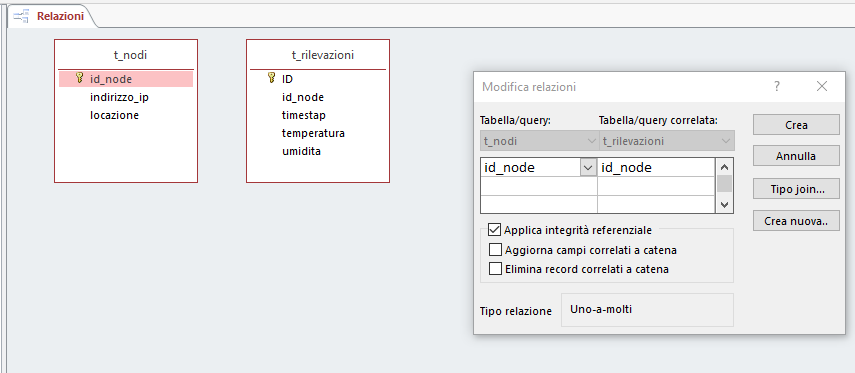
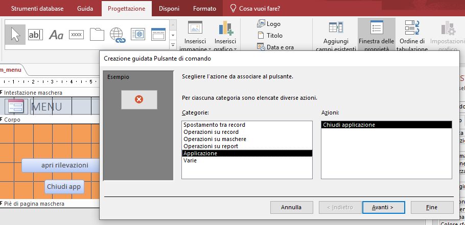
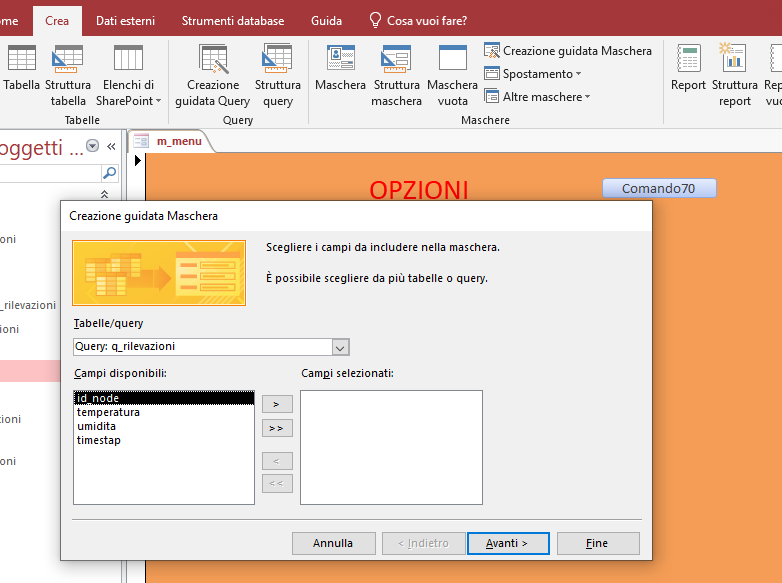
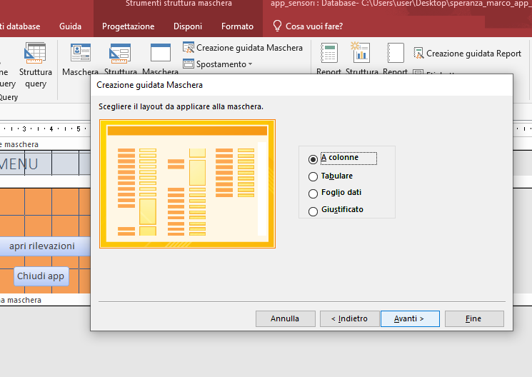
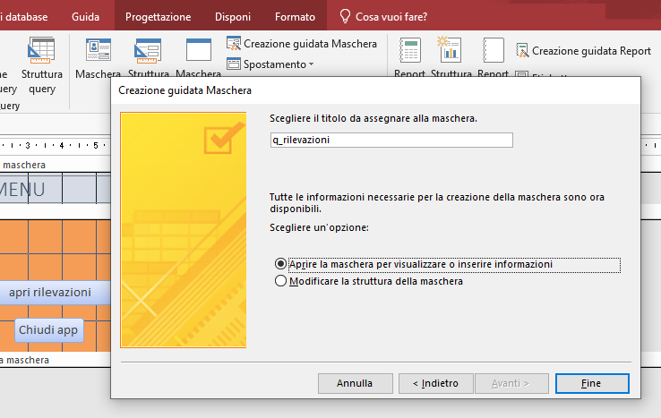
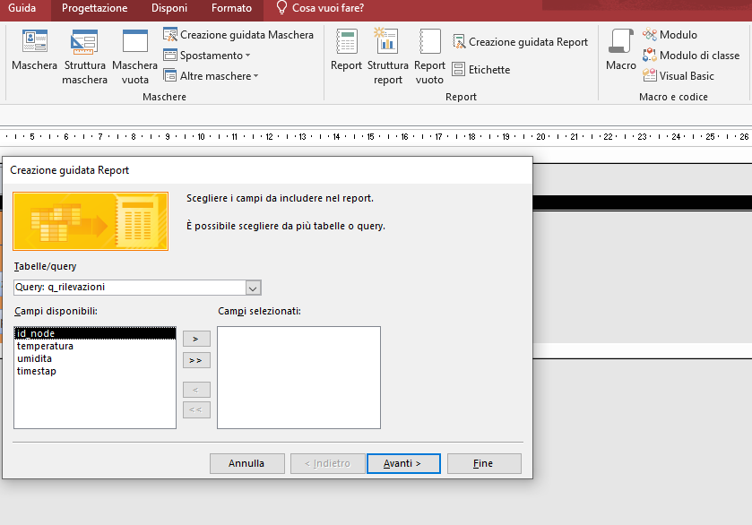
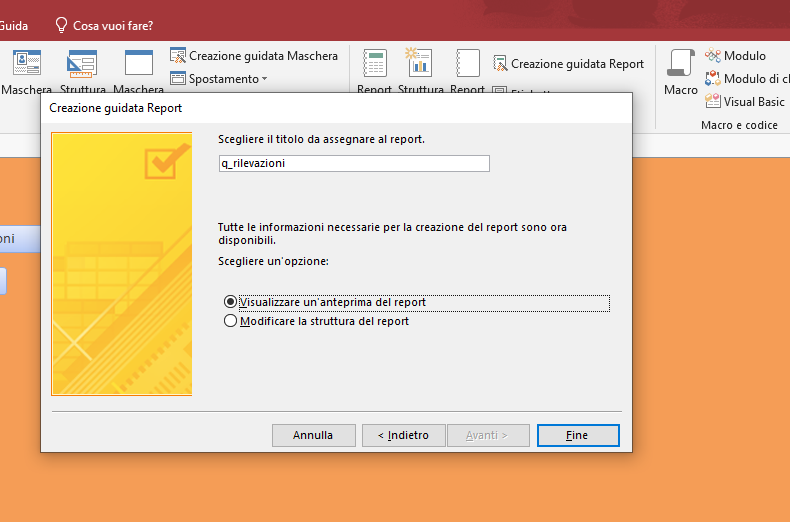
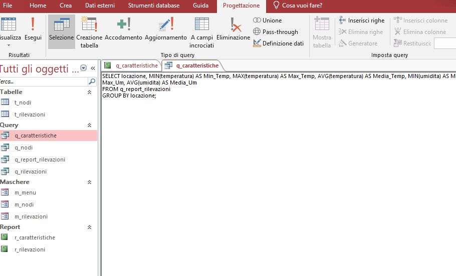

**Autore:** Marco Speranza
**Classe:** 4at
#   Applicazione in Access app_sensori01_02
---
#### versione: 01_01
##  Obbitivo: 
Realizzare usando le maschere ed i report di Access un' applicazione per l'inserimento e la visualizzazione dei dati.
##  Descrizione:
Uno dei fattori per la creazione di un buon database consiste nell'evitare che i dati si dublicano. Per raggiongere questo obbiettivo, bisogna dividere i dati in piu tabelle in base all'argomento in modo che ogni dato sia rappresentato una sola volta. In seguito bisogna dare dei campi comuni alle tabelle per ricollegare le informazioni quando serve.
#####    Relazioni_tabelle
Nella mie relazione, faccio in modo che se sulla tabella t_rilevazioni, quando si cerca di inserire, un qualche record, che abbia nel campo della stanza un' informazione non presente nella tabella t_nodi, acess blocchera l'inserimento di tale informazione.

Una relazione di questo tipo funziona collegando i dati nei campi chiave:
*   la **chiave primaria**  della tabella t_nodi (chiamata id_node)
*   la **chiave esterna** della tabella t_rilevaziioni (chiamata id_node)

Una cosa molto importante da fare durante il processo è selezionare l'integrita referenziale. Questa proprieta effettua un controllo sull'inserimento dei dati, verifica che i valori della chiave esterna siano compatibili con quelli della chiave primaria.

Questo tipo di rilevazione è uno a molti. Una stanza puo avere un numero x di rilevazioni. Quindi per ogni stanza rappresentata dalla tabella t_nodi, potrebbero esserci piu rilevazioni nella tabella t_rilevazioni

#####	Pulsanti
Per creare pulsanti, cisualizzo la strottura e vado sull'area di progettazione. In seguito seleziono l'icona del pulsante e seguo la guida per dire al pulsante cosa fare. In questo caso gli diro di chiudere l'applicazione.

#####	Maschere
Le maschere sono utilizzate dagli utenti per aggiungere, modificare o visualizzare i dati memorizzati nel database desktop Access (dove visualizza in un modo piu grafico). Per creare la maschera la modalita in cui visualizzo non interferisce, vado sulla sezione crea di Access e seleziono cereazione guidata maschera e poi seguo le istruzioni che sanno elencate di seguito inserendo in seguito dove voglio che le informzioni vengono prese/inserite. Con la maschera vuota posso personalizzarmi il modo di visualizzare le informazioni e cosi creare il menu.Per la creazione guidata prima seleziono la tabella/query con le colonne che desidero visualizzare.

Poi devo selezionare il layout che voglio:

E poi dovro dirli cosa puo fare la maschera se solo visualizzare e inserire o anche avere la possibilita di modificare i record (nel mio caso puo solo visualizzare e inserire):

#####	Report
I report ofrono un modo per visualizzare e riepilogare le informazioni nel database, non si possono aggiungere record in un report. Per crearlo il procedimento è molto simile alla maschera. Vado sulla sezione crea di access e seleziono creazione guidata di una maschera access che in seguido mi dara diverse opzione per personalizzare il report.
L'origine dei record da visualizzare deve contenere tutti i record e le colonne che desidero visualizzare puo essere una query o una tabella.

Dopo aver definito in che ordine dovranno essere visualizzate le informazioni dovro dire il layout, e infine seleziono le proprieta che deve avere.

---
#### versione: 01_02
##  Obbitivo: 
Aggiungere un report che riporti i valori minimi, massimi, medi rilevati nelle varie stanze e o dai vari sensori
##  Descrizione:
Per mettere queste caratterisctiche io ho usato direttamente il linguaggio SQL su una query creata al momento,per dopo prendere le informazioni che mi interessano da un report per visualizzarle alla fine.Per dare questo ho vatto questo procedimento: 
1.  Per creare la query sulla sezione crea seleziono "Strottura Query"
2.  Poi seleziono la tabella che mi interessa e seleziono la modalita di visualizzazione "visualizza SQL". (Nel mio caso q_report_rilevazioni)
3.  Dopo mi comparira una pagina in cui dovro dirli che cosa fare effettivamente
4.  Scrivo il codice SQL che deve visualizzare TEMPERATURA/UMIDIMA min/max/avg e eseguo il codice


Il codice utilizzato per fare la selsect e il seguente:
```sql
SELECT locazione, MIN(temperatura) AS Min_Temp, MAX(temperatura) AS Max_Temp, AVG(temperatura) AS Media_Temp, MIN(umidita) AS Min_Um, MAX(umidita) AS Max_Um, AVG(umidita) AS Media_Um 
FROM q_report_rilevazioni 
GROUP BY locazione;
```